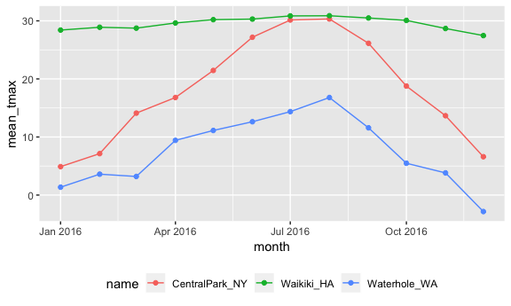

Exploratory Analysis
================
Diana Ballesteros
10/4/2018

``` r
knitr::opts_chunk$set(
  fig.width = 6,
  fig.asp = .6,
  out.width = "90%"
)

devtools::install_github("thomasp85/patchwork")
```

    ## Skipping install of 'patchwork' from a github remote, the SHA1 (fd7958ba) has not changed since last install.
    ##   Use `force = TRUE` to force installation

``` r
library(tidyverse)
```

    ## ── Attaching packages ───────────────────────────────────────────────────────────────────── tidyverse 1.2.1 ──

    ## ✔ ggplot2 3.0.0     ✔ purrr   0.2.5
    ## ✔ tibble  1.4.2     ✔ dplyr   0.7.6
    ## ✔ tidyr   0.8.1     ✔ stringr 1.3.1
    ## ✔ readr   1.1.1     ✔ forcats 0.3.0

    ## ── Conflicts ──────────────────────────────────────────────────────────────────────── tidyverse_conflicts() ──
    ## ✖ dplyr::filter() masks stats::filter()
    ## ✖ dplyr::lag()    masks stats::lag()

``` r
weather_df = 
  rnoaa::meteo_pull_monitors(c("USW00094728", "USC00519397", "USS0023B17S"),
                      var = c("PRCP", "TMIN", "TMAX"), 
                      date_min = "2016-01-01",
                      date_max = "2016-12-31") %>%
  mutate(
    name = recode(id, USW00094728 = "CentralPark_NY", 
                      USC00519397 = "Waikiki_HA",
                      USS0023B17S = "Waterhole_WA"),
    tmin = tmin / 10,
    tmax = tmax / 10,
    month = lubridate::floor_date(date, unit = "month")) %>%
  select(name, id, date, month, everything())
```

Start Groupping
---------------

``` r
weather_df %>% 
  group_by(name, month)
```

    ## # A tibble: 1,098 x 7
    ## # Groups:   name, month [36]
    ##    name           id          date       month       prcp  tmax  tmin
    ##    <chr>          <chr>       <date>     <date>     <dbl> <dbl> <dbl>
    ##  1 CentralPark_NY USW00094728 2016-01-01 2016-01-01     0   5.6   1.1
    ##  2 CentralPark_NY USW00094728 2016-01-02 2016-01-01     0   4.4   0  
    ##  3 CentralPark_NY USW00094728 2016-01-03 2016-01-01     0   7.2   1.7
    ##  4 CentralPark_NY USW00094728 2016-01-04 2016-01-01     0   2.2  -9.9
    ##  5 CentralPark_NY USW00094728 2016-01-05 2016-01-01     0  -1.6 -11.6
    ##  6 CentralPark_NY USW00094728 2016-01-06 2016-01-01     0   5    -3.8
    ##  7 CentralPark_NY USW00094728 2016-01-07 2016-01-01     0   7.8  -0.5
    ##  8 CentralPark_NY USW00094728 2016-01-08 2016-01-01     0   7.8  -0.5
    ##  9 CentralPark_NY USW00094728 2016-01-09 2016-01-01     0   8.3   4.4
    ## 10 CentralPark_NY USW00094728 2016-01-10 2016-01-01   457  15     4.4
    ## # ... with 1,088 more rows

``` r
weather_df %>%
  group_by(month) %>%
  summarize(n = n())
```

    ## # A tibble: 12 x 2
    ##    month          n
    ##    <date>     <int>
    ##  1 2016-01-01    93
    ##  2 2016-02-01    87
    ##  3 2016-03-01    93
    ##  4 2016-04-01    90
    ##  5 2016-05-01    93
    ##  6 2016-06-01    90
    ##  7 2016-07-01    93
    ##  8 2016-08-01    93
    ##  9 2016-09-01    90
    ## 10 2016-10-01    93
    ## 11 2016-11-01    90
    ## 12 2016-12-01    93

Does the same thing!!!
----------------------

``` r
weather_df %>%
  count(month)
```

    ## # A tibble: 12 x 2
    ##    month          n
    ##    <date>     <int>
    ##  1 2016-01-01    93
    ##  2 2016-02-01    87
    ##  3 2016-03-01    93
    ##  4 2016-04-01    90
    ##  5 2016-05-01    93
    ##  6 2016-06-01    90
    ##  7 2016-07-01    93
    ##  8 2016-08-01    93
    ##  9 2016-09-01    90
    ## 10 2016-10-01    93
    ## 11 2016-11-01    90
    ## 12 2016-12-01    93

Grouped Summaries
-----------------

``` r
weather_df %>%
  group_by(month) %>%
  summarize(n_obs = n(),
            n_days = n_distinct(date))
```

    ## # A tibble: 12 x 3
    ##    month      n_obs n_days
    ##    <date>     <int>  <int>
    ##  1 2016-01-01    93     31
    ##  2 2016-02-01    87     29
    ##  3 2016-03-01    93     31
    ##  4 2016-04-01    90     30
    ##  5 2016-05-01    93     31
    ##  6 2016-06-01    90     30
    ##  7 2016-07-01    93     31
    ##  8 2016-08-01    93     31
    ##  9 2016-09-01    90     30
    ## 10 2016-10-01    93     31
    ## 11 2016-11-01    90     30
    ## 12 2016-12-01    93     31

``` r
##na.rm takes away the missing data by default 
weather_df %>%
  group_by(month) %>%
  summarize(mean_tmax = mean(tmax),
            mean_prec = mean(prcp, na.rm = TRUE),
            median_tmax = median(tmax),
            sd_tmax = sd(tmax))
```

    ## # A tibble: 12 x 5
    ##    month      mean_tmax mean_prec median_tmax sd_tmax
    ##    <date>         <dbl>     <dbl>       <dbl>   <dbl>
    ##  1 2016-01-01      11.6      50.4         5     12.4 
    ##  2 2016-02-01      13.2      38.9         8.8   12.1 
    ##  3 2016-03-01      15.4      42.9        13.3   11.2 
    ##  4 2016-04-01      18.6      11.5        18.3    9.63
    ##  5 2016-05-01      20.9      15.8        21.1    8.92
    ##  6 2016-06-01      23.4      16.6        28.3    8.61
    ##  7 2016-07-01      25.1      39.5        29.4    8.14
    ##  8 2016-08-01      26.0      11.5        30      7.02
    ##  9 2016-09-01      22.7      19.1        26.7    8.74
    ## 10 2016-10-01      18.1      51.5        18.3   10.5 
    ## 11 2016-11-01      15.4      72.1        14.7   10.8 
    ## 12 2016-12-01      10.4      36.5         7.8   13.1

``` r
weather_df %>%
  group_by(name, month) %>%
  summarize(mean_tmax = mean(tmax)) %>%
  ggplot(aes(x = month, y = mean_tmax, color = name)) + 
    geom_point() + geom_line() + 
    theme(legend.position = "bottom")
```



``` r
weather_df %>%
  group_by(name, month) %>%
  summarize(mean_tmax = mean(tmax)) %>% 
  spread(key = month, value = mean_tmax) %>% 
  knitr::kable(digits = 1)
```

| name            |  2016-01-01|  2016-02-01|  2016-03-01|  2016-04-01|  2016-05-01|  2016-06-01|  2016-07-01|  2016-08-01|  2016-09-01|  2016-10-01|  2016-11-01|  2016-12-01|
|:----------------|-----------:|-----------:|-----------:|-----------:|-----------:|-----------:|-----------:|-----------:|-----------:|-----------:|-----------:|-----------:|
| CentralPark\_NY |         4.9|         7.1|        14.1|        16.8|        21.5|        27.2|        30.1|        30.3|        26.1|        18.8|        13.7|         6.6|
| Waikiki\_HA     |        28.4|        28.9|        28.7|        29.6|        30.2|        30.3|        30.8|        30.9|        30.5|        30.1|        28.7|        27.5|
| Waterhole\_WA   |         1.4|         3.6|         3.2|         9.4|        11.1|        12.6|        14.4|        16.8|        11.6|         5.5|         3.8|        -2.8|
