Vizualization Part 1
================
Diana Ballesteros
9/27/2018

``` r
library(tidyverse)
```

    ## ── Attaching packages ──────────────────────────────────────────────────────── tidyverse 1.2.1 ──

    ## ✔ ggplot2 3.0.0     ✔ purrr   0.2.5
    ## ✔ tibble  1.4.2     ✔ dplyr   0.7.6
    ## ✔ tidyr   0.8.1     ✔ stringr 1.3.1
    ## ✔ readr   1.1.1     ✔ forcats 0.3.0

    ## ── Conflicts ─────────────────────────────────────────────────────────── tidyverse_conflicts() ──
    ## ✖ dplyr::filter() masks stats::filter()
    ## ✖ dplyr::lag()    masks stats::lag()

``` r
library(ggridges)
```

    ## 
    ## Attaching package: 'ggridges'

    ## The following object is masked from 'package:ggplot2':
    ## 
    ##     scale_discrete_manual

``` r
library(rnoaa)
weather_df = 
  rnoaa::meteo_pull_monitors(c("USW00094728", "USC00519397", "USS0023B17S"),
                      var = c("PRCP", "TMIN", "TMAX"), 
                      date_min = "2017-01-01",
                      date_max = "2017-12-31") %>%
  mutate(
    name = recode(id, USW00094728 = "CentralPark_NY", 
                      USC00519397 = "Waikiki_HA",
                      USS0023B17S = "Waterhole_WA"),
    tmin = tmin / 10,
    tmax = tmax / 10) %>%
  select(name, id, everything())
weather_df
```

    ## # A tibble: 1,095 x 6
    ##    name           id          date        prcp  tmax  tmin
    ##    <chr>          <chr>       <date>     <dbl> <dbl> <dbl>
    ##  1 CentralPark_NY USW00094728 2017-01-01     0   8.9   4.4
    ##  2 CentralPark_NY USW00094728 2017-01-02    53   5     2.8
    ##  3 CentralPark_NY USW00094728 2017-01-03   147   6.1   3.9
    ##  4 CentralPark_NY USW00094728 2017-01-04     0  11.1   1.1
    ##  5 CentralPark_NY USW00094728 2017-01-05     0   1.1  -2.7
    ##  6 CentralPark_NY USW00094728 2017-01-06    13   0.6  -3.8
    ##  7 CentralPark_NY USW00094728 2017-01-07    81  -3.2  -6.6
    ##  8 CentralPark_NY USW00094728 2017-01-08     0  -3.8  -8.8
    ##  9 CentralPark_NY USW00094728 2017-01-09     0  -4.9  -9.9
    ## 10 CentralPark_NY USW00094728 2017-01-10     0   7.8  -6  
    ## # ... with 1,085 more rows

Start a plot
------------

Blank Plot...

``` r
##this is just give you a graph that will show you what it will look like
ggplot(weather_df, aes(x = tmin, y = tmax))
```

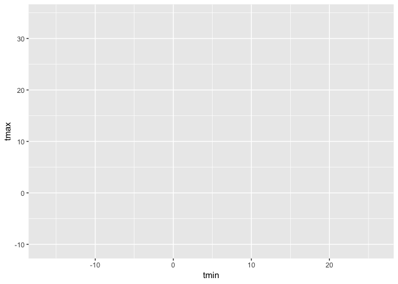

Scatteplot..

``` r
##geompoint allows you to take the data and create points out of it 
ggplot(weather_df, aes(x = tmin, y = tmax)) + 
  geom_point()
```

    ## Warning: Removed 15 rows containing missing values (geom_point).


``` r
##this plot will give you a plot that focuses only on Central Park 
weather_df %>% 
  filter(name == "CentralPark_NY") %>% 
  ggplot(aes(x = tmin, y = tmax)) + 
  geom_point()
```


``` r
## allows you save your plot without using ggsave 
weather_sp = 
  ggplot(weather_df,aes(x = tmin, y = tmax)) + 
  geom_point()
```

Boring Plot
-----------

``` r
plot_weather = 
  weather_df %>%
  ggplot(aes(x = tmin, y = tmax)) 

plot_weather + geom_point()
```

    ## Warning: Removed 15 rows containing missing values (geom_point).

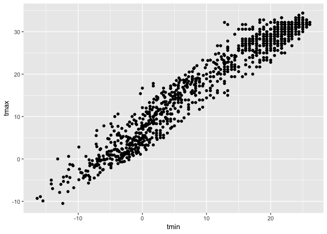

More Plot Options
-----------------

Add an aesthetic

``` r
ggplot(weather_df, aes(x = tmin, y = tmax)) + 
  geom_point(aes(color = name))
```

    ## Warning: Removed 15 rows containing missing values (geom_point).

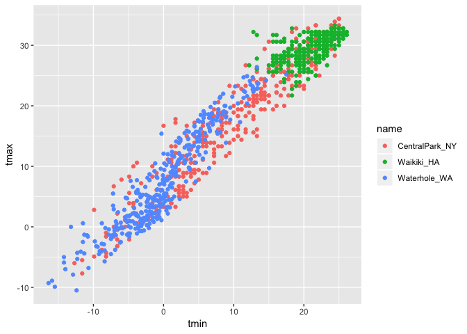

Add a geom

``` r
##geomsmooth() adds a smooth line through your data points, adding se = FALSE turns off the standard error bars which he recommends that we use. Adding an alpha makes the points clearer to see
ggplot(weather_df, aes(x = tmin, y = tmax)) + 
  geom_point(aes(color = name), alpha = 0.4) +
  geom_smooth(se = FALSE)
```

    ## `geom_smooth()` using method = 'gam' and formula 'y ~ s(x, bs = "cs")'

    ## Warning: Removed 15 rows containing non-finite values (stat_smooth).

    ## Warning: Removed 15 rows containing missing values (geom_point).


``` r
##Aethetics map is for creating a smooth curve with each color 
ggplot(weather_df, aes(x = tmin, y = tmax, color = name)) + 
  geom_point(alpha = .4) +
  geom_smooth(se = FALSE)
```

    ## `geom_smooth()` using method = 'loess' and formula 'y ~ x'

    ## Warning: Removed 15 rows containing non-finite values (stat_smooth).

    ## Warning: Removed 15 rows containing missing values (geom_point).

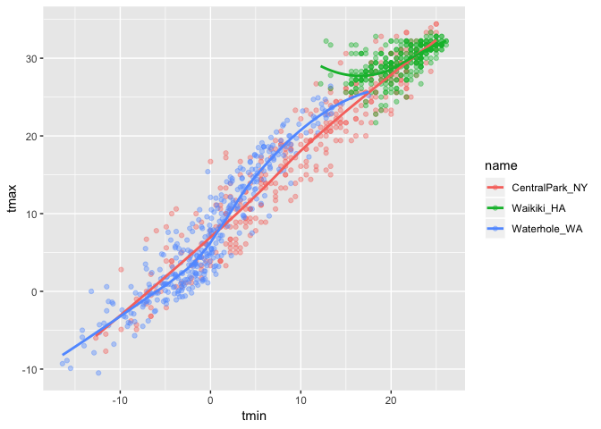

Facetting...

``` r
## Divide your plot against another vairable, creating separtate plots for each variable  
ggplot(weather_df, aes(x = tmin, y = tmax, color = name)) + 
  geom_point(alpha = .4) +
  geom_smooth(se = FALSE) + 
  facet_grid( ~ name)
```

    ## `geom_smooth()` using method = 'loess' and formula 'y ~ x'

    ## Warning: Removed 15 rows containing non-finite values (stat_smooth).

    ## Warning: Removed 15 rows containing missing values (geom_point).

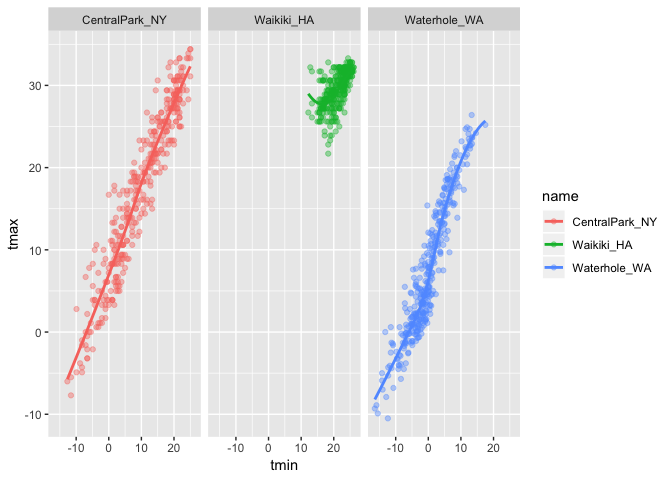

A more interesting plot, adding by date

``` r
## Boring one...added a geompoint
ggplot(weather_df, aes(x = date, y = tmax)) + 
  geom_point()
```

    ## Warning: Removed 3 rows containing missing values (geom_point).

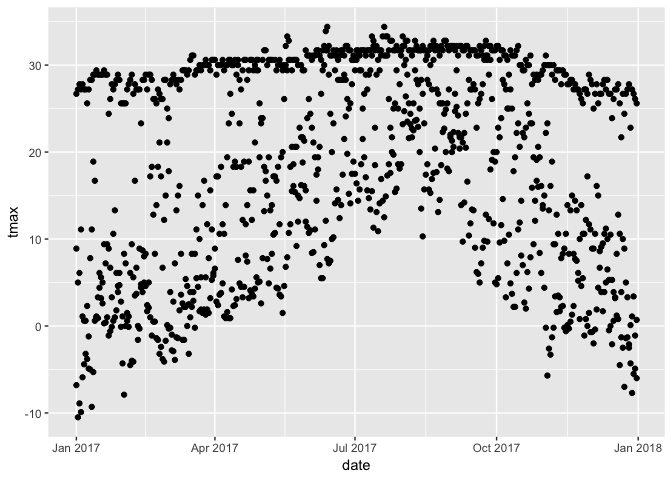

``` r
## Adding color
ggplot(weather_df, aes(x = date, y = tmax, color = name)) + 
  geom_point()
```

    ## Warning: Removed 3 rows containing missing values (geom_point).


``` r
## Adding a line instead
ggplot(weather_df, aes(x = date, y = tmax, color = name)) + 
  geom_line()
```

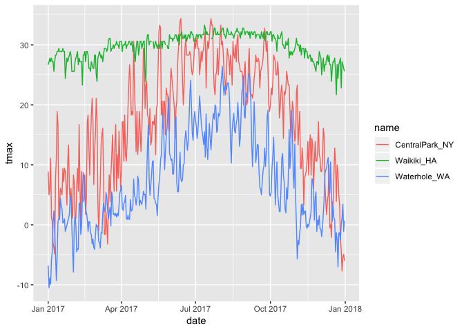

``` r
## Smooth, often not enough data to show and would not use 
ggplot(weather_df, aes(x = date, y = tmax, color = name)) + 
  geom_smooth(se = FALSE) 
```

    ## `geom_smooth()` using method = 'loess' and formula 'y ~ x'

    ## Warning: Removed 3 rows containing non-finite values (stat_smooth).

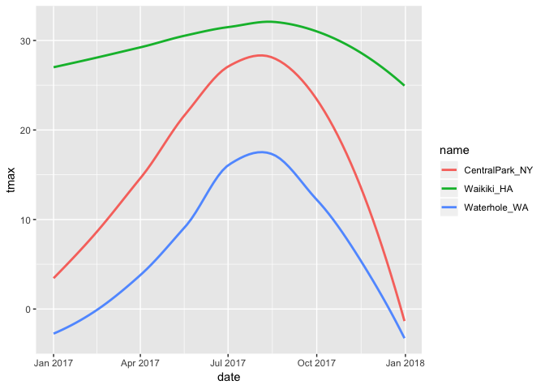

``` r
## Hexagon
ggplot(weather_df, aes(x = tmax, y = tmin)) + 
  geom_hex()
```

    ## Warning: Removed 15 rows containing non-finite values (stat_binhex).

    ## Warning: Computation failed in `stat_binhex()`:
    ## Package `hexbin` required for `stat_binhex`.
    ## Please install and try again.


``` r
## Allows you to do it by adding precipitation
ggplot(weather_df, aes(x = date, y = tmax, color = name, size = prcp)) + 
  geom_point() + 
  geom_smooth(se = FALSE) + 
  facet_grid(~name)
```

    ## `geom_smooth()` using method = 'loess' and formula 'y ~ x'

    ## Warning: Removed 3 rows containing non-finite values (stat_smooth).

    ## Warning: Removed 3 rows containing missing values (geom_point).

 \#\# Learning Assessment

``` r
weather_df %>% 
  filter(name == "CentralPark_NY") %>% 
  mutate(tmax_fahr = tmax * (9 / 5) + 32,
         tmin_fahr = tmin * (9 / 5) + 32) %>% 
  ggplot(aes(x = tmin_fahr, y = tmax_fahr)) +
  geom_point(alpha = .5) + 
  geom_smooth(method = "lm", se = FALSE)
```


Learning Assessment
-------------------

``` r
## Color is set to be blue outside of the aesthetic
ggplot(weather_df) + geom_point(aes(x = tmax, y = tmin), color = "blue")
```

    ## Warning: Removed 15 rows containing missing values (geom_point).

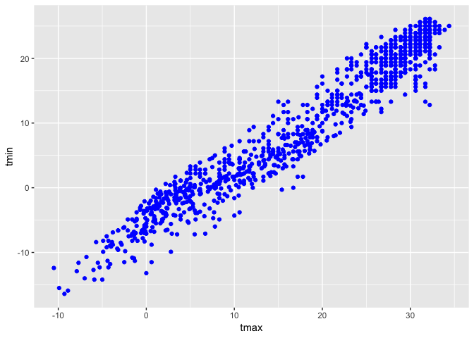

``` r
## ggplot is looking for a variable that is blue and will color whichever 
ggplot(weather_df) + geom_point(aes(x = tmax, y = tmin, color = "blue"))
```

    ## Warning: Removed 15 rows containing missing values (geom_point).

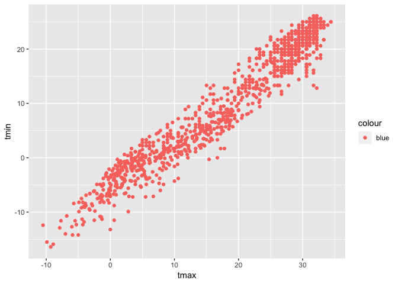

Univariate Plots
----------------

Histograms

``` r
##you don't need to identify y because it is a freq, but will need to identify x axis 
ggplot(weather_df, aes(x = tmax)) + 
  geom_histogram()
```

    ## `stat_bin()` using `bins = 30`. Pick better value with `binwidth`.

    ## Warning: Removed 3 rows containing non-finite values (stat_bin).

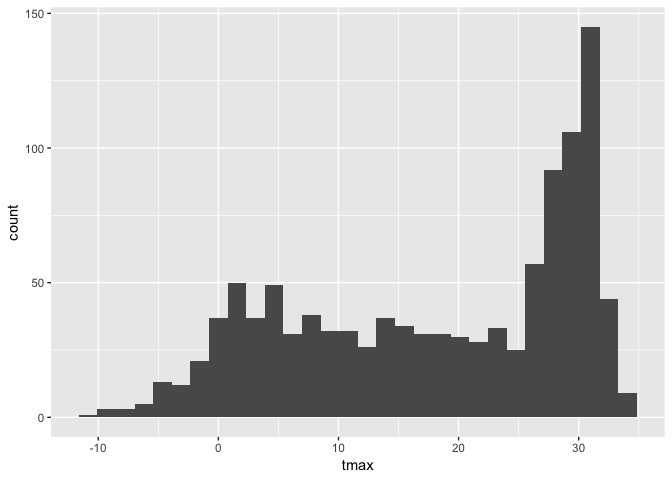

``` r
ggplot(weather_df, aes(x = tmax)) + 
  geom_histogram() + 
  facet_grid(~name)
```

    ## `stat_bin()` using `bins = 30`. Pick better value with `binwidth`.

    ## Warning: Removed 3 rows containing non-finite values (stat_bin).


``` r
ggplot(weather_df, aes(x = tmax, fill = name)) + 
  geom_histogram(position = "dodge", binwidth = 2)
```

    ## Warning: Removed 3 rows containing non-finite values (stat_bin).

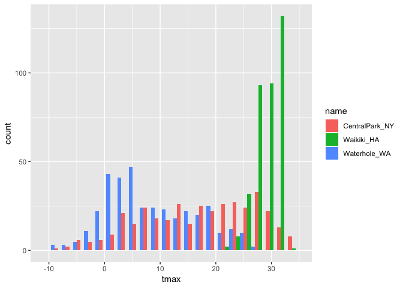

Density Plot - a smooth histogram

``` r
ggplot(weather_df, aes(x = tmax, fill = name)) + 
  geom_density(alpha = .4, adjust = .5, color = "blue")
```

    ## Warning: Removed 3 rows containing non-finite values (stat_density).

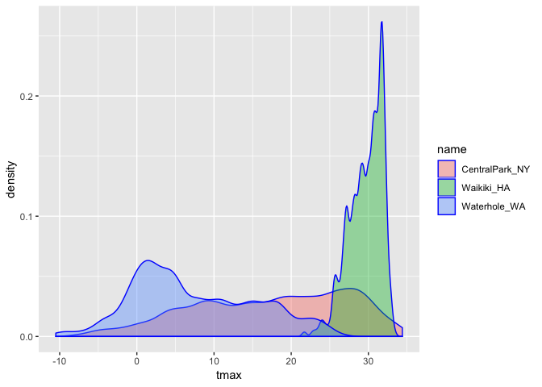

Boxplot

``` r
##without name 
ggplot(weather_df, aes(y = tmax)) + 
  geom_boxplot()
```

    ## Warning: Removed 3 rows containing non-finite values (stat_boxplot).

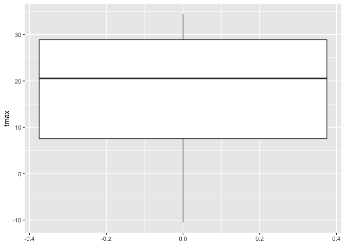

``` r
## with name 
ggplot(weather_df, aes(x = name, y = tmax)) + 
  geom_boxplot()
```

    ## Warning: Removed 3 rows containing non-finite values (stat_boxplot).


Violin Plot, maybe helpful in telling you that it is a bimodal

``` r
## without color 
ggplot(weather_df, aes(x = name, y = tmax)) + 
  geom_violin()
```

    ## Warning: Removed 3 rows containing non-finite values (stat_ydensity).


``` r
## with color 
ggplot(weather_df, aes(x = name, y = tmax)) + 
  geom_violin(aes(fill = name), color = "blue", alpha = .5) + 
  stat_summary(fun.y = median, geom = "point", color = "blue", size = 4)
```

    ## Warning: Removed 3 rows containing non-finite values (stat_ydensity).

    ## Warning: Removed 3 rows containing non-finite values (stat_summary).

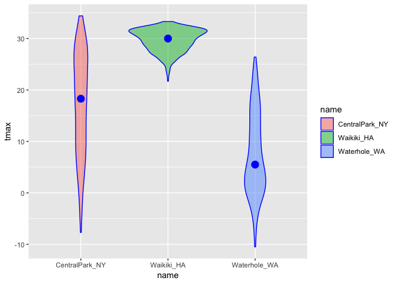

``` r
## in class
ggplot(weather_df, aes(x = tmax, y = name)) + 
  geom_density_ridges()
```

    ## Picking joint bandwidth of 1.84

    ## Warning: Removed 3 rows containing non-finite values (stat_density_ridges).

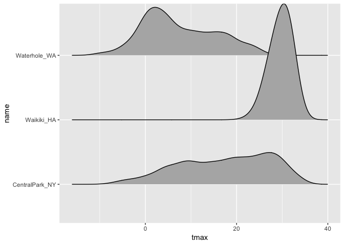

``` r
## Website 
ggplot(weather_df, aes(x = tmax, y = name)) + 
  geom_density_ridges(scale = .85)
```

    ## Picking joint bandwidth of 1.84

    ## Warning: Removed 3 rows containing non-finite values (stat_density_ridges).


Saving Plots
------------

``` r
weather_plot = ggplot(weather_df, aes(x = tmin, y = tmax)) + 
  geom_point(aes(color = name), alpha = .5) 

ggsave("weather_plot.pdf", weather_plot, width = 8, height = 5)
```

    ## Warning: Removed 15 rows containing missing values (geom_point).

Last Example (still need to review)
-----------------------------------

Mkase a bunch of plots!!

``` r
## Boxplot is the best for this in compared to all these plots
ggplot(weather_df, aes(y = prcp, x = name)) + 
  geom_boxplot()
```

    ## Warning: Removed 3 rows containing non-finite values (stat_boxplot).

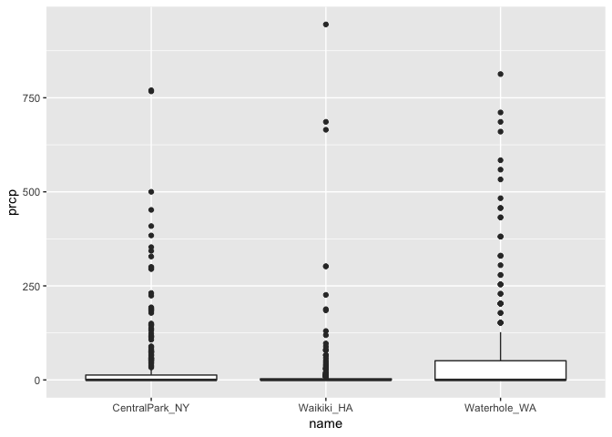

``` r
## changing the geometry to a violin plot, but this is not as helpful 
ggplot(weather_df, aes(y = prcp, x = name, fill = name)) + 
  geom_violin(alpha = 0.5)
```

    ## Warning: Removed 3 rows containing non-finite values (stat_ydensity).

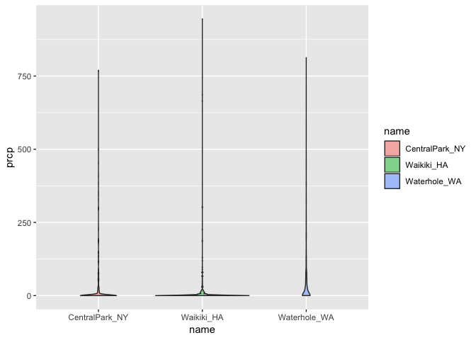

``` r
## 
weather_df %>% 
  filter(prcp < 100) %>% 
  ggplot(aes(x = prcp, fill = name)) + 
  geom_density(alpha = .5)
```

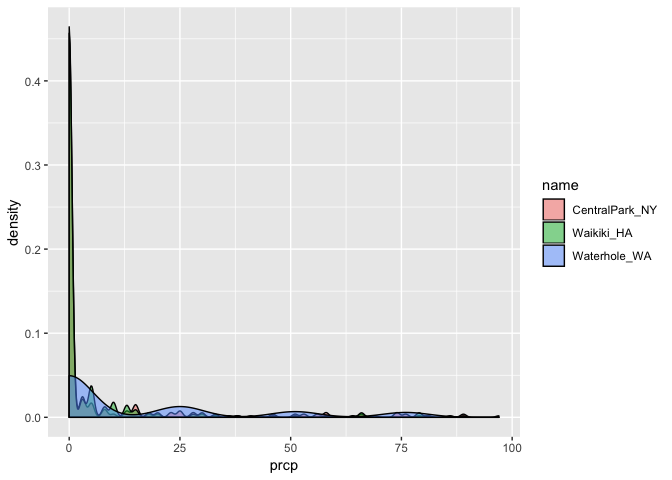
